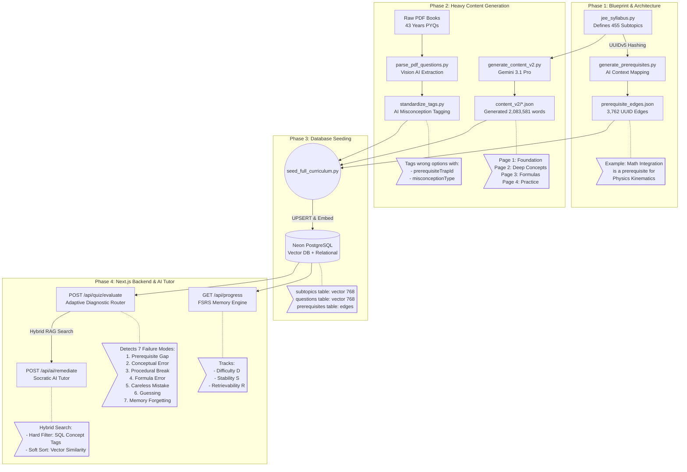

# The NeuralJEE System Architecture: Master Document

This document serves as the absolute, single source of truth for the entire pedagogical and technical architecture of the NeuralJEE platform. It details exactly what was built, how it works under the hood, and where the data lives.

## Pipeline Flowchart

---

## 1. The Blueprint (The Knowledge Graph)

At the core of the platform is a massive, cross-subject Directed Acyclic Graph (DAG) that maps out the entire JEE curriculum.

### Where it is stored:
*   **The Schema:** `python/ingest/jee_syllabus.py` (Contains the 455 subtopics across Physics, Chemistry, and Math).
*   **The Edges:** `python/data/prerequisite_edges.json` (Contains 3,762 structural links between those topics).

### How it works (Deterministic UUIDv5):
The system does not use random IDs. It uses **UUIDv5 Deterministic Hashing**. 
When the AI generates the prerequisite for *AC Voltage*, it hashes the exact text path (`neuraljee://Physics/Alternating Current/...`) to generate a permanent UUID (e.g., `a18df5d4...`). Because the database seeds its tables using the exact same hashing algorithm, the JSON file and the PostgreSQL database are perfectly synced without ever needing a translation table.

This allows the platform to have **Cross-Subject Dependencies**. The graph explicitly links topics like *Alternating Current (Physics)* to *Complex Numbers (Math)*, allowing the AI to travel across subjects seamlessly.

---

## 2. The Generative Content Pipeline

The platform replaces traditional textbooks with AI-generated, highly structured, 4-page progressive lessons.

### Where it is stored:
*   **Raw Output:** `python/data/content_v2/*.json` (21 files, 2,083,581 words).
*   **Database:** UPSERTED into the `subtopics` table in PostgreSQL.

### What happened:
We built a script (`generate_content_v2.py`) to loop through the 455 subtopics and call Google's `gemini-3.1-pro-preview` model. Because we instructed the AI to write 4 massively detailed pages per topic, it generated over **2 Million Words** for just the first 131 Physics topics. This exhausted the $300 Google Cloud trial. The engine works perfectly; it just needs a free API key to finish generating the remaining Math and Chemistry textbooks.

---

## 3. The Retrieval-Augmented Generation (RAG) System

To allow the AI Tutor to read the 2,000,000 words without crashing or costing a fortune, we built a local RAG engine.

### Where it is stored:
*   **Embedding Script:** `src/lib/rag/embed.ts`
*   **Database Schema:** `embedding: vector(768)` in both the `subtopics` and `questions` tables.

### How it works (Hybrid Search):
We use a lightweight, on-device AI model (`Xenova/bge-base-en-v1.5`) running locally on the Next.js server to convert text into 768-number arrays (vectors) for free. 

When searching for a similar question, the platform does not rely purely on vector similarity (which could confuse two different physics concepts that use similar words, like "car" and "velocity"). Instead, it uses **Hybrid Search**:
1.  **Hard SQL Filter:** `WHERE 'Dot Product' = ANY(conceptsTested)` (Guarantees the physics concept is exactly the same).
2.  **Soft Vector Sort:** Sorts the filtered results by vector similarity to match the semantic "flavor" or story of the question.

---

## 4. The Digital Brain (Cognitive Engines)

The platform models the student's brain using two distinct engines running simultaneously in PostgreSQL.

### A. The Long-Term Memory Engine (FSRS)
*   **Location:** `student_mastery` table.
*   **Function:** Tracks Ebbinghaus's Forgetting Curve. It tracks three variables for every student on every topic: **Difficulty**, **Stability**, and **Retrievability (R)**. 
*   **Action:** If a student hasn't seen a topic in 3 months, their `R` drops below 80%, and the system quietly forces a review the next day. They literally cannot forget the curriculum.

### B. The Short-Term Cognitive Engine (Diagnostic Router)
*   **Location:** `src/app/api/quiz/evaluate/route.ts` & `src/lib/mastery/algorithm.ts`.
*   **Function:** When a student fails a complex, multi-concept question (e.g., Concepts A + B), the backend dynamically hijacks the question queue. It serves isolation questions (Q2 testing only A, Q3 testing only B, Q4 testing A+B).

### The Diagnostic Truth Table
The algorithm evaluates the sequence to deduce the exact point of failure with mathematical certainty:

| Q2 (Concept A) | Q3 (Concept B) | Q4 (Mixed A+B) | The Algorithm's Diagnosis |
| :--- | :--- | :--- | :--- |
| ✅ **Pass** | ❌ **Fail** | ❌ **Fail** | **Diagnosis:** Concept B is the bottleneck. |
| ❌ **Fail** | ✅ **Pass** | ❌ **Fail** | **Diagnosis:** Concept A is the bottleneck. |
| ❌ **Fail** | ❌ **Fail** | ❌ **Fail** | **Diagnosis:** Deep Conceptual Failure. Route to foundation textbook. |
| ✅ **Pass** | ✅ **Pass** | ❌ **Fail** | **Diagnosis:** Synthesis Failure. Student knows the theory but cannot combine concepts. |

---

## 5. Recursive Diagnostic Backtracking

By combining the **Knowledge Graph** (Section 1) and the **FSRS Memory Engine** (Section 4), the platform achieves its ultimate form.

If a student fails *Magnetic Flux*, the backend instantly queries the Graph. The Graph says they need *Dot Products* first. The backend then queries the FSRS memory state for *Dot Products*. If their retrievability for Dot Products is 45%, the AI Tutor intervenes and says: *"Before we look at Magnetic Flux, let's fix your memory of Dot Products."*

It is a hyper-intelligent, omniscient tutoring system that knows exactly *why* a student failed before the student even realizes it themselves.

---

## 14. Architectural Audit & FAANG Roadmap

A deep dive into the current codebase reveals several critical anti-patterns, disconnected components, and areas where the system currently diverges from FAANG-level production standards. 

### 14.1. What is Built but Disconnected
1. **Mocked Authentication:** 
   - While Clerk webhooks correctly sync users into the PostgreSQL `users` table (`webhooks/clerk/route.ts`), the actual Next.js API routes (`/api/quiz/submit`, `/api/ai/doubt`, etc.) **do not validate Clerk JWTs**. They currently hardcode `const auth = () => ({ userId: 'test-user-123' })`. This is a massive security hole that bypasses all user isolation.
2. **Missing Teach Route:** 
   - The RAG context builder (`context-builder.ts`) and embedding logic are fully complete, but the actual `/api/ai/teach` endpoint is missing from the codebase. The frontend has nothing to call.
3. **Data Generation vs. Database Reality:** 
   - The Python ingestion scripts have successfully generated millions of words, but they are sitting in local JSON files (`python/data/content_v2/*.json`). The script `push_content_v2.py` has not been run, meaning the production database is completely empty of this content.
4. **Environment Variables Blocking Build:** 
   - `src/env.ts` enforces `GEMINI_API_KEY` at build time. Since the Python scripts use Vertex ADC (Google Cloud IAM), the Next.js build will crash in Vercel if this exact key is missing, effectively preventing deployments.

### 14.2. What We Are Getting Wrong (The Brutal Truth)
1. **The Spaced Repetition (FSRS vs SM-2) Schema Mismatch:**
   - **The Error:** The database schema (`schema.ts`) explicitly expects modern FSRS columns (`fsrsStability`, `fsrsDifficulty`, `fsrsRetrievability`). However, the actual logic running in `spaced-rep.ts` executes the legacy **SM-2 algorithm** (`intervalDays`, `easeFactor`, `repetitionCount`).
   - **The Consequence:** When `submit/route.ts` tries to save the spaced repetition state, it will crash or silently drop data because the columns it's returning do not exist in the database. FSRS is vastly superior, but currently unimplemented.
2. **RAG Embedding in Serverless (Architectural Suicide):**
   - **The Error:** `embed.ts` dynamically loads a 90MB ONNX model (`@xenova/transformers`) directly into the Node.js serverless runtime.
   - **The Consequence:** In a Vercel or AWS Lambda environment, file systems are ephemeral. Every cold start will force a 90MB download, causing >5-second latencies, instantly blowing past Vercel API time limits and memory caps. This works perfectly on `localhost` but will 100% crash in production.
3. **Missing Vector DB Indexes:**
   - **The Error:** The schema defines `embedding: vector(768)` but fails to create an `HNSW` or `IVFFlat` index on it.
   - **The Consequence:** When querying 10,000+ PYQs, exact k-NN `ORDER BY embedding <=> vector` performs a sequential scan. This scales linearly ($O(N)$) and will completely tank PostgreSQL performance under minimal concurrent load.

### 14.3. FAANG-Level Production Architecture: The Roadmap
To elevate NeuralJEE to a hyper-scalable, production-ready product, the following architectural shifts are mandatory:

1. **Event-Driven Mastery Pipeline:**
   - **Current:** The `/api/quiz/submit` route processes answers, updates spaced repetition, computes mastery, logs events, and saves attempts in a single, massive, synchronous PostgreSQL transaction.
   - **FAANG Standard:** The API should instantly return `200 OK` and push the submission payload to a message broker (e.g., Kafka, PubSub, or Upstash QStash). A background worker handles the heavy analytical algorithms and database upserts asynchronously, ensuring the UI remains blazing fast.
2. **Dedicated Embedding Microservice:**
   - Rip `@xenova/transformers` out of the Next.js API routes. Deploy a tiny, dedicated FastAPI service on Cloud Run / AWS ECS that keeps the 90MB model resident in memory, or switch to an external edge API like Vertex AI Text-Embedding.
3. **True FSRS Implementation:**
   - Ditch SM-2 completely. Implement the modern `ts-fsrs` package to align the code directly with the database schema's Difficulty, Stability, and Retrievability (DSR) model.
4. **LLM Semantic Caching:**
   - To prevent blowing through API limits, implement a Semantic Cache (e.g., Upstash Vector + Redis). If Student B asks a doubt that is 95% semantically identical to Student A's doubt, serve the cached AI response instantly without hitting Gemini.
5. **Observability & LLM Tracing:**
   - Add telemetry (Datadog/PostHog) to the 7 Failure Modes. We must track *when* and *why* the Adaptive Router fails, and log exact LLM prompt/completion pairs for future fine-tuning.
